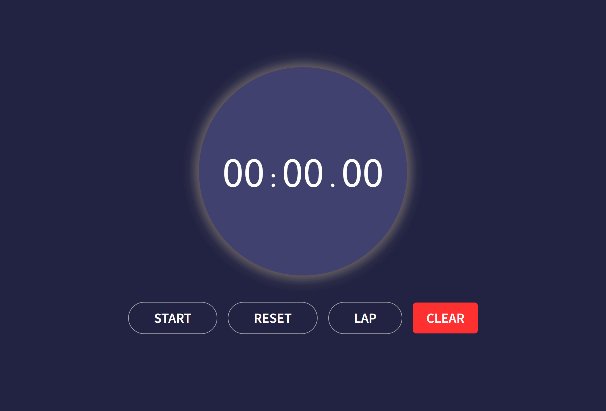

# STOPWATCH-JS
A simple Stopwatch web application project developed using HTML, CSS, and JavaScript.

## Overview
The Simple Stopwatch Web Application is a basic web-based stopwatch implemented using HTML, CSS, and JavaScript. It offers essential functionalities such as start, stop, reset, lap count, and clearing lap times.

## Features
- **Start/Stop:** You can start and stop the stopwatch timer with a single click.
- **Reset:** Reset the timer to zero.
- **Lap Count:** Record lap times while the timer is running.
- **Clear Lap Times:** Clear all lap time records.
- **Responsive Design:** The application is designed to be responsive and work well on various screen sizes.
